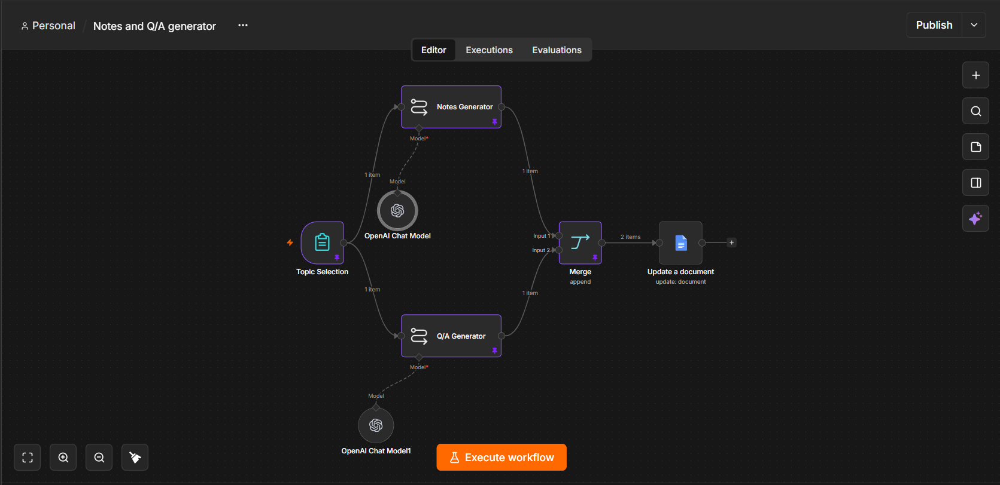

# Notes and Q/A Generator

## 🎯 Goal
A first hands-on n8n workflow that takes any topic name from a user and automatically generates both structured study notes and a set of interview-style MCQs on that topic, then saves everything straight into a Google Doc.

## ⚙️ Features
- Simple form input to submit a topic to revise
- AI-generated study notes (headings, bullet points, examples, summary) via GPT-4o
- AI-generated 10 interview-style MCQs (3 easy, 4 medium, 3 difficult, 4 options each) via GPT-4o
- Both outputs merged into a single item
- Result auto-inserted into an existing Google Doc

## 🧩 Workflow Breakdown

| # | Node | Type | What it does |
|---|------|------|---------------|
| 1 | **Topic Selection** | Form Trigger | Starts the workflow when a user submits a topic via a form field ("Enter the Topic name want to revise/explore.") |
| 2 | **Notes Generator** | LangChain LLM Chain | Takes the submitted topic and prompts GPT-4o to generate clear, well-structured study notes |
| 3 | **OpenAI Chat Model** | OpenAI Chat Model (LangChain) | The GPT-4o model instance feeding the Notes Generator chain |
| 4 | **Q/A Generator** | LangChain LLM Chain | Takes the same topic in parallel and prompts GPT-4o to generate exactly 10 MCQs with a fixed easy/medium/difficult split |
| 5 | **OpenAI Chat Model1** | OpenAI Chat Model (LangChain) | A separate GPT-4o model instance feeding the Q/A Generator chain |
| 6 | **Merge** | Merge | Combines the Notes Generator output (input 0) and Q/A Generator output (input 1) into one item |
| 7 | **Update a document** | Google Docs | Inserts the merged text into an existing Google Doc via OAuth2 credentials |

**Flow shape:** Topic Selection branches into two parallel LLM chains (Notes + Q/A), which recombine at Merge before being written to Google Docs — a clean example of the parallel-workflow pattern that comes up later in the course.

## 🖼️ Preview

Architecture of the workflow as built in n8n:

## 🗂️ Files
- `workflow.json` — full exported workflow, importable via **n8n → Workflows → Import from File**
- `screenshot.png` — canvas screenshot showing the full node layout and connections

## 🐛 What Broke / Lessons
- Each LangChain LLM Chain node needs its **own** attached Chat Model node — reusing one OpenAI Chat Model node for both chains isn't how it's wired here; that's why there are two nearly identical model nodes (`OpenAI Chat Model` and `OpenAI Chat Model1`) instead of one shared one.
- The Merge node's two branches must be wired to different input indices (0 and 1) — otherwise the Notes and Q/A text would overwrite each other instead of combining.
- *(Add any errors or surprises you personally hit while building this — this section is meant to capture what the docs don't tell you.)*

## 📎 Import Instructions
`n8n → Workflows → Import from File → workflow.json`
