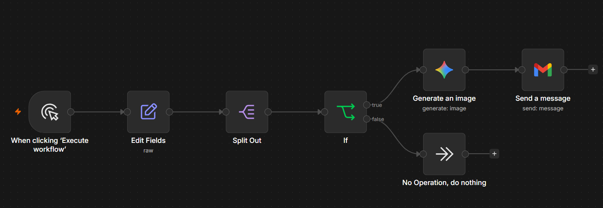
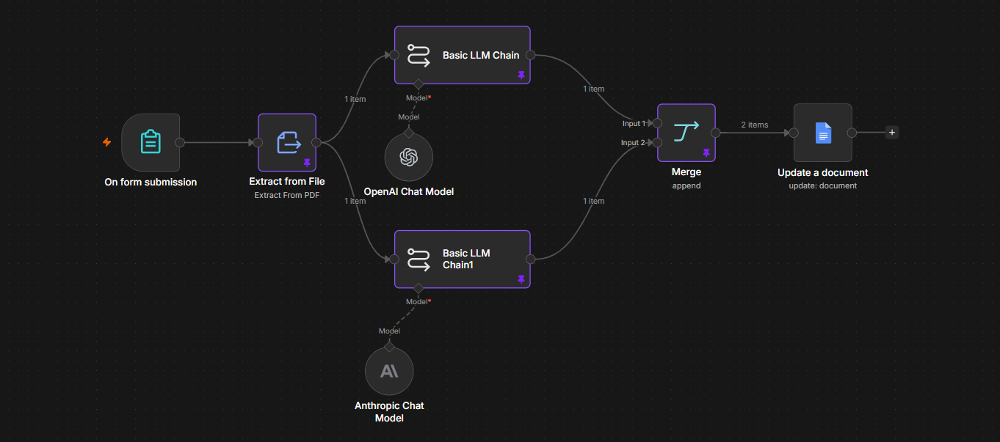
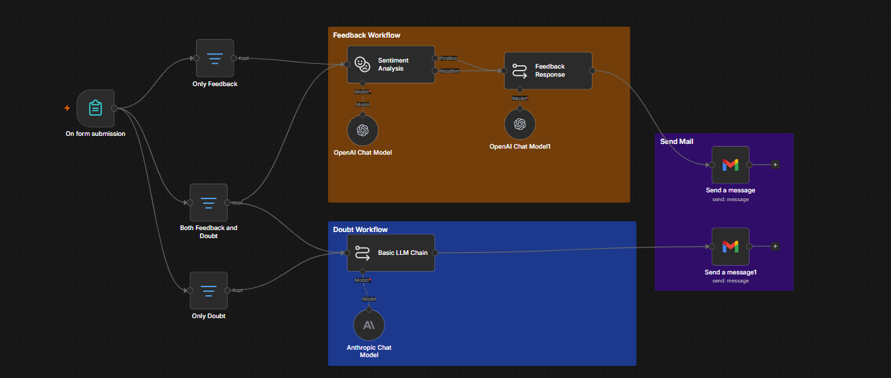

# Combined Workflows

This folder holds workflows that mix more than one workflow-type pattern (branching, parallel execution, data reshaping) in a single flow, rather than demonstrating just one pattern in isolation. Three examples are documented here, each combining a different pair of patterns.

```
combined-workflow/
├── README.md
├── send-coupon-premium-customers/
│   ├── workflow.json
│   └── screenshot.png
├── summarize-research-paper/
│   ├── workflow.json
│   └── screenshot.png
└── student-feedback-and-doubt-clearance/
    ├── workflow.json
    └── screenshot.png
```

---

## 1. Send Coupon Premium Customers
*Combines: data reshaping (Split Out) + conditional branching (IF)*



**Goal:** From a static list of customers, identify the ones whose order amount qualifies for a premium discount, generate a coupon image for them, and email it — skipping everyone else.

**Workflow Breakdown**

| # | Node | Type | What it does |
|---|------|------|---------------|
| 1 | When clicking 'Execute workflow' | Manual Trigger | Starts the workflow manually |
| 2 | Edit Fields | Set (raw JSON) | Hardcodes a sample dataset: `name`, `age`, `order_amount` arrays for 3 customers |
| 3 | Split Out | Split Out | Unpacks the 3 arrays into 3 separate items, one per customer |
| 4 | If | IF | Checks `order_amount > 10` per item |
| 5a | Generate an image | Google Gemini (image) | *(true branch)* Generates a "20% FLAT DISCOUNT" coupon image |
| 5b | No Operation, do nothing | NoOp | *(false branch)* Customer doesn't qualify — nothing happens |
| 6 | Send a message | Gmail | Emails the generated coupon image as an attachment |

**Files:** `workflow.json` (importable via n8n → Workflows → Import from File)

**Lessons:** Of the 3 sample customers, only one (`order_amount: 15`) passes the IF condition, so only one image + email actually gets generated per run — the other two silently hit the No Operation node. The email subject and body are also currently hardcoded rather than personalized per customer, which would need an expression pulling from the branch's item data.

---

## 2. Summarize Research Paper
*Combines: parallel AI processing (two simultaneous LLM chains) + merge convergence*



**Goal:** Upload a research paper PDF and get back both a plain-language summary and a technical breakdown of its equations/code, combined into one document.

**Workflow Breakdown**

| # | Node | Type | What it does |
|---|------|------|---------------|
| 1 | On form submission | Form Trigger | User uploads a single PDF file |
| 2 | Extract from File | Extract from File (PDF) | Extracts raw text from the uploaded PDF |
| 3 | Basic LLM Chain | LangChain LLM Chain (GPT-5-mini) | Summarizes the paper: problem, methodology, findings, conclusions, limitations |
| 4 | Basic LLM Chain1 | LangChain LLM Chain (Anthropic) | Extracts key equations, derivations, algorithms, and code from the same text, in parallel |
| 5 | Merge | Merge | Combines both chains' outputs into one item (input 0 = summary, input 1 = derivations) |
| 6 | Update a document | Google Docs | Writes the merged result into a Google Doc |

**Files:** `workflow.json` (importable via n8n → Workflows → Import from File)

**Lessons:** The same extracted text feeds two different LLM providers (OpenAI and Anthropic) at once for two very different analytical tasks — a good example of why each parallel branch needs its own dedicated Chat Model node rather than sharing one.

---

## 3. Student Feedback and Doubt Clearance
*Combines: conditional branching (3-way Filter classification) + parallel execution within one branch*



**Goal:** Let a student submit feedback and/or a doubt through one form, automatically classify which case applies, and send back the appropriate AI-generated email response(s).

**Workflow Breakdown**

| # | Node | Type | What it does |
|---|------|------|---------------|
| 1 | On form submission | Form Trigger | Collects email, optional feedback, optional doubt |
| 2 | Only Feedback | Filter | Passes through only when feedback is filled AND doubt is empty |
| 3 | Only Doubt | Filter | Passes through only when doubt is filled AND feedback is empty |
| 4 | Both Feedback and Doubt | Filter | Passes through only when both fields are filled |
| 5 | Sentiment Analysis | LangChain Sentiment Analysis | Classifies feedback as Positive/Negative (runs for "Only Feedback" and "Both" cases) |
| 6 | Feedback Response | LangChain LLM Chain | Generates a personalized HTML email based on the feedback + sentiment |
| 7 | Basic LLM Chain | LangChain LLM Chain (Anthropic) | Generates a doubt-clearing response (runs for "Only Doubt" and "Both" cases) |
| 8 | Send a message / Send a message1 | Gmail | Sends the Feedback Response and/or Doubt Response emails |

**The combined logic:** the three Filter nodes act like a Switch, routing one submission down exactly one of three mutually exclusive paths. What makes this "combined" rather than purely conditional is the "Both" path — it doesn't just pick one response, it fans out to **both** the Sentiment Analysis chain and the doubt-clearing chain at once, running them in parallel and sending two separate emails from a single form submission.

**Files:** `workflow.json` (importable via n8n → Workflows → Import from File)

**Lessons:** Using three separate Filter nodes with complementary (mutually exclusive) conditions is a manual way to achieve Switch-like branching. It works, but a single Switch node with three output rules would express the same logic more compactly and be easier to maintain than three independent Filter conditions that all have to stay in sync.

---

## 📎 Import Instructions (all three)
`n8n → Workflows → Import from File → workflow.json` (from the relevant subfolder)