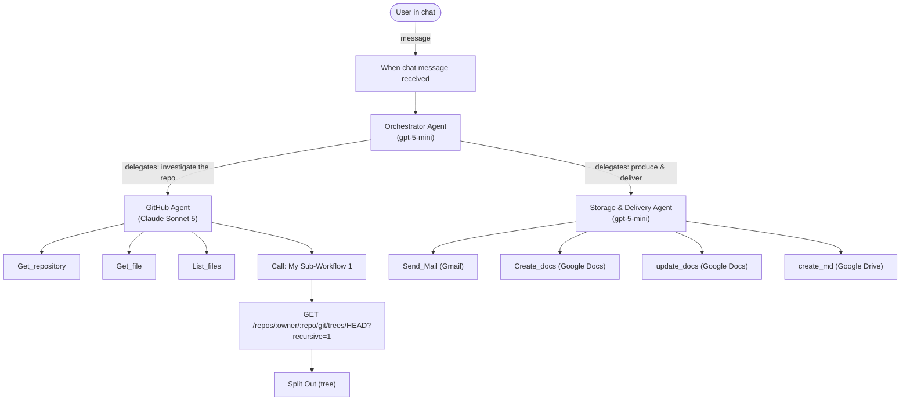

# AI Code Buddy

A multi-agent n8n workflow that takes a GitHub repository link, investigates it, and turns that investigation into README files, setup guides, Google Docs, or an emailed report — all through a single chat interface.

This is Capstone Project 2 from the n8n "Building AI Agents" course: point it at a repo and it reads the code, explains what the project does, and produces documentation on demand.

## Table of Contents

- [Why I Built This](#why-i-built-this)
- [What It Does](#what-it-does)
- [Architecture](#architecture)
- [How a Request Flows Through the System](#how-a-request-flows-through-the-system)
- [Agents & Tools](#agents--tools)
- [Project Structure](#project-structure)
- [Setup](#setup)
- [Usage](#usage)
- [Design Notes](#design-notes)
- [Known Issues & Limitations](#known-issues--limitations)
- [What This Project Demonstrates](#what-this-project-demonstrates)

## Why I Built This

Reading an unfamiliar codebase and writing good documentation for it are both slow, manual tasks. This project explores whether a small team of specialized AI agents — one that only reads GitHub, one that only produces deliverables, and one that manages both — can do that work reliably, without inventing facts about the code it hasn't actually seen.

## What It Does

Given a GitHub repo link in chat, the system can:

1. Summarize what the project is and why it exists.
2. Produce a quickstart / installation guide.
3. Explain the architecture and how modules connect.
4. List important functions, classes, and objects with descriptions.
5. Generate a complete, accurate repository file tree.
6. Turn any of the above into a `README.md`, a Google Doc, or an email.
7. Answer follow-up questions about the repo as an ongoing Q&A chat.

## Architecture

Three agents, each with a narrow job description, coordinated by an orchestrator:




📎 Raw n8n canvas exports — open directly rather than viewing inline (these are DOM-based SVG exports, so they render as a full page but not as an embedded image): [Workflow canvas ↗](./ai-code-buddy-workflow-diagram.svg) · [Sub-workflow canvas ↗](./ai-code-buddy-subworkflow-diagram.svg)

- **Orchestrator Agent** never touches GitHub or the filesystem itself — it only classifies the request and hands it to the right specialist.
- **GitHub Agent** never writes documents or sends mail — it only investigates and returns structured, evidence-backed findings.
- **Storage & Delivery Agent** never inspects the repository — it only turns verified findings into a deliverable and stores/sends it.

That separation is enforced entirely through each agent's system prompt (see [`SYSTEM_PROMPTS.md`](./SYSTEM_PROMPTS.md)), not through code — this is a prompt-engineering project as much as a workflow-building one.

## How a Request Flows Through the System

Example: *"Analyze github.com/owner/repo and create a README, then email it to me."*

1. **Chat Trigger** receives the message and hands it to the Orchestrator.
2. **Orchestrator Agent** extracts the owner/repo from the URL and classifies this as a README-generation + email-delivery task.
3. It delegates a precise instruction to the **GitHub Agent**: inspect metadata, the full tree, README, manifests, and entry points.
4. The GitHub Agent calls `Get_repository`, `List_files` / the recursive tree sub-workflow, and `Get_file` as needed, then returns a structured **Analysis Package** (purpose, tech stack, structure, architecture, dependencies, install/usage — each tagged as verified, inferred, or unknown).
5. The Orchestrator passes that package to the **Storage & Delivery Agent** with an instruction to build a README.
6. The Storage & Delivery Agent writes the Markdown, calls `create_md` to save it to the configured Google Drive folder, then calls `Send_Mail` with a short summary and the file location.
7. The Orchestrator reports back to the user: what was created, where it's stored, and whether the email sent successfully.

Both memory buffer nodes (context window = 10) let the Orchestrator and Storage agents handle multi-turn follow-ups like "now also make it a Google Doc" without re-explaining the repo.

## Agents & Tools

| Agent | Model | Tools it can call | Job |
|---|---|---|---|
| **Orchestrator Agent** | GPT-5 mini | GitHub Agent, Storage & Delivery Agent | Classify intent, delegate, verify, give the final answer |
| **GitHub Agent** | Claude Sonnet 5 | `Get_repository`, `Get_file`, `List_files`, sub-workflow tree fetch | Investigate the repo; return only evidence-backed findings |
| **Storage & Delivery Agent** | GPT-5 mini | `create_md`, `Create_docs`, `update_docs`, `Send_Mail` | Turn findings into a README / Doc / email; never invent repo facts |

GitHub Agent runs on Claude Sonnet 5 while both other agents run on GPT-5 mini — a deliberate split covered in [Design Notes](#design-notes).

## Project Structure

```
ai-code-buddy/
├── ai-code-buddy-workflow.json     # Main workflow (My_workflow.json) — chat trigger + 3 agents
├── ai-code-buddy-subflow.json      # "My Sub-Workflow 1" — recursive GitHub tree fetch
diagram
├── ai-code-buddy-workflow-diagram.svg    # Raw n8n canvas export — main workflow
├── ai-code-buddy-subworkflow-diagram.svg # Raw n8n canvas export — sub-workflow
├── SYSTEM_PROMPTS.md               # Full system prompts for all three agents
└── README.md                       # This file
```

## Setup

1. **Import both workflows** into n8n: the main workflow and `ai-code-buddy-subflow.json`.
2. In the main workflow's *"Call 'My Sub-Workflow 1'"* node, re-point `workflowId` at your imported copy of the sub-workflow (n8n assigns a new ID on import).
3. **Connect credentials:**
   - OpenAI (or your AI Gateway) — used by the Orchestrator and Storage & Delivery Agents (`gpt-5-mini`)
   - Anthropic — used by the GitHub Agent (`claude-sonnet-5`)
   - GitHub OAuth2 — for `Get_repository`, `Get_file`, `List_files`
   - Gmail OAuth2 — for `Send_Mail`
   - Google Docs OAuth2 — for `Create_docs` / `update_docs`
   - Google Drive OAuth2 — for `create_md`, pointed at a folder of your choice
4. **Activate** the main workflow — the chat trigger exposes a webhook you can talk to directly from n8n's chat panel or your own front end.

## Usage

Talk to it like a colleague who's already read the repo:

- *"What does github.com/owner/repo do, and how do I run it locally?"*
- *"Give me a full file tree for that repo."*
- *"Turn that into a README and save it as Markdown."*
- *"Make a Google Doc out of that architecture explanation and email it to me@example.com."*
- *"What does the `parseConfig()` function in `src/config.js` do?"*

## Design Notes

- **Two model providers, on purpose.** The GitHub Agent — the one actually reading source code and reasoning about architecture — runs on Claude Sonnet 5; the Orchestrator and the formatting-heavy Storage & Delivery Agent run on the cheaper GPT-5 mini. Analysis quality where it matters most, cost efficiency everywhere else.
- **Evidence discipline as the anti-hallucination mechanism.** Every agent's prompt requires findings to be labeled VERIFIED / INFERRED / UNKNOWN, and the Storage Agent is explicitly forbidden from inventing files, commands, or dependencies not supplied by the GitHub Agent. The reliability of the output rests entirely on this prompt contract, not on any code-level validation.
- **A custom sub-workflow for the full tree.** n8n's built-in GitHub node lists one directory at a time; it has no single operation for a complete recursive tree. `My Sub-Workflow 1` calls GitHub's Git Trees API directly (`?recursive=1`) to get every path in one request, then `Split Out`s the array so the GitHub Agent can reason over it item by item.
- **Agents as tools, not as separate flows.** Both the GitHub Agent and the Storage & Delivery Agent are `agentTool` nodes wired as tools of the Orchestrator, rather than parallel branches — the Orchestrator decides at runtime whether a request needs one, the other, or both in sequence.

## Known Issues & Limitations

- **Sub-workflow field mismatch (verified in code):** the sub-workflow's trigger defines inputs `owner` and `repo_name`, but its HTTP Request node builds the URL from `{{ $json.owner }}/{{ $json.repo }}` — `repo` is never defined, only `repo_name` is. As written, the repository segment of the GitHub API URL resolves to nothing, so the tree fetch would fail. Fixing it is a one-line change (`$json.repo` → `$json.repo_name`).
- **Unauthenticated GitHub API call:** the sub-workflow's HTTP Request node carries no credentials, so it hits GitHub's REST API unauthenticated — subject to the ~60 requests/hour public rate limit, and unable to reach private repositories.
- **Single hardcoded Drive destination:** `create_md` and `Create_docs` are wired to one fixed Google Drive folder, so all generated files land in the same place regardless of which repo they're about.
- **No visible retry/error-handling branches:** the main workflow relies on each agent's prompt-level "Error Recovery" instructions rather than n8n-level error-trigger nodes or retries.
- **Sub-workflow calls are restricted to the same owner** (`callerPolicy: workflowsFromSameOwner`), so it can't be shared as a standalone public tool without adjusting that setting.

## What This Project Demonstrates

- Multi-agent orchestration in n8n, using `agentTool` sub-agents rather than a single monolithic prompt.
- Prompt-level guardrails (verified/inferred/unknown evidence tiers) as a substitute for code-level fact-checking.
- Mixing LLM providers within one workflow based on which task actually needs the stronger model.
- Building a custom HTTP-based sub-workflow to cover a gap in a built-in node's capabilities.
