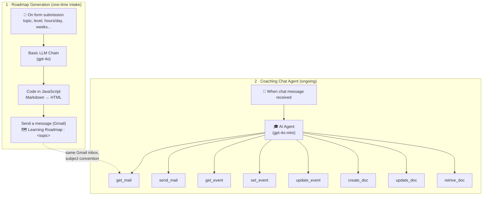

# AI Coach

A personalized learning system built in n8n: fill out a form describing what you want to learn, get a full week-by-week roadmap by email, then keep working with an ongoing AI mentor that reads that roadmap, schedules your study sessions, writes your notes, tests you, and adapts — through Gmail, Google Calendar, and Google Docs.

This is Capstone Project 3 from the n8n "Building AI Agents" course.

## Table of Contents

- [Why I Built This](#why-i-built-this)
- [What It Does](#what-it-does)
- [Architecture](#architecture)
- [How a Request Flows Through the System](#how-a-request-flows-through-the-system)
- [Workflows & Tools](#workflows--tools)
- [Project Structure](#project-structure)
- [Setup](#setup)
- [Usage](#usage)
- [Design Notes](#design-notes)
- [What This Project Demonstrates](#what-this-project-demonstrates)

## Why I Built This

A one-off "generate me a study plan" chatbot is easy; sticking to that plan is the hard part. This project splits the problem in two: a workflow that turns a learner's stated goal into a real, structured roadmap, and a separate long-running agent whose entire job is to keep the learner executing that roadmap — scheduling time for it, testing progress against it, and adapting when things don't go as planned.

## What It Does

**Part 1 — Roadmap Generation** *(one-time intake)*
A learner fills out a form (topic, current level, target level, time commitment, duration, days/week, primary goal). An LLM turns that into a complete, realistic, week-by-week (and day-by-day, where appropriate) learning roadmap — prerequisites, milestones, projects, and assessments included — and emails it as a formatted HTML document.

**Part 2 — Coaching Chat Agent** *(ongoing)*
A chat agent with tools across Gmail, Google Calendar, and Google Docs that:

1. Reads the roadmap from the learner's inbox when needed.
2. Builds and adjusts a study schedule on Google Calendar.
3. Writes topic-wise study notes as Google Docs.
4. Sends reminders, deadline alerts, and progress emails.
5. Runs quizzes and coding assessments, scores them, and identifies weak areas.
6. Answers follow-up questions and keeps the learner aligned with the roadmap.

## Architecture

Two independent n8n workflows, connected only by a shared Gmail inbox and a subject-line convention — not by any direct n8n link:



📎 Raw n8n canvas exports — open directly rather than viewing inline (DOM-based SVG exports render as a full page, not as an embedded image): [Chat agent canvas ↗](./ai-coach-chat-agent-diagram.svg) · [Roadmap generation canvas ↗](./ai-coach-roadmap-generation-diagram.svg)

The two workflows never call each other. The handoff is entirely implicit: the roadmap email always carries the subject `🗺️ Learning Roadmap : <topic>`, and the coaching agent's `get_mail` tool is told to search for exactly that string whenever it needs roadmap content that isn't already in conversation memory.

Full prompts for both the coaching agent and the roadmap-generation chain are in [`SYSTEM_PROMPTS.md`](./SYSTEM_PROMPTS.md).

## How a Request Flows Through the System

**Getting a roadmap:**

1. The learner submits the intake form — topic, current/target level, time commitment, duration, days per week, primary goal (exam, job, project, etc.).
2. **Basic LLM Chain** (gpt-4o, temperature 0.6) generates a complete Markdown roadmap: goal, learner profile, week-by-week plan, daily schedules where appropriate, projects, milestones, and assessments — calculating available learning time from `hours/day × days/week × weeks` and refusing to overload the schedule.
3. **Code in JavaScript** runs a small hand-written Markdown→HTML converter ([`ai-coach-markdown-to-html.js`](./ai-coach-markdown-to-html.js) — headings, tables, lists, links, bold/italic, code blocks, all via regex, no external library) to make the roadmap readable in an email client.
4. **Send a message** emails the HTML roadmap to the address the learner entered, with the subject the coaching agent will later search for.

**Coaching day-to-day**, e.g. *"Set up my study schedule for this week"*:

1. **Chat Trigger** passes the message to the **AI Agent**.
2. If the roadmap isn't already in conversation memory, the agent calls `get_mail` to find it.
3. It calls `get_event` to check the learner's existing calendar before proposing new sessions.
4. It calls `set_event` to create study blocks with descriptive titles (`"AI Coach — Python Functions"`) and descriptions (topic, objective, practice task, roadmap stage).
5. It only reports a session as scheduled once `set_event` actually confirms success — the prompt explicitly forbids claiming a calendar/email/doc action succeeded without tool confirmation.

**Running a quiz** works similarly but stays entirely in conversation: the agent pulls the relevant roadmap topic and difficulty, generates questions, evaluates the learner's answers, calls out weak areas, and recommends what to revisit next — calling `create_doc` only if the learner wants the results saved.

## Workflows & Tools

| Workflow | Trigger | Model | Tools | Job |
|---|---|---|---|---|
| **Roadmap Generation** | Form submission | gpt-4o (temp 0.6, max 2000 tokens) | *(linear chain, no tool-calling)* | Turn an intake form into a structured Markdown roadmap, convert to HTML, email it |
| **Coaching Chat Agent** | Chat message | gpt-4o-mini | `get_mail`, `send_mail` · `get_event`, `set_event`, `update_event` · `create_doc`, `update_doc`, `retrive_doc` | Ongoing mentor: reads the roadmap, schedules study time, writes notes, tests the learner, adapts, answers questions |

## Project Structure

```
ai-coach/
├── ai-coach-roadmap-generation.json         # Form → LLM → HTML → email (one-time intake) 
├── ai-coach-markdown-to-html.js              # Markdown→HTML converter, extracted from the 
├── ai-coach-chat-agent.json                 #  (Gmail + Calendar + Docs tools) 
├── ai-coach-chat-agent-diagram.svg          # Raw n8n canvas export — chat agent
├── ai-coach-roadmap-generation-diagram.svg  # Raw n8n canvas export — roadmap generation
├── SYSTEM_PROMPTS.md                        # prompts for the coaching agent and the roadmap-generation chain
└── README.md                                # This file
```

## Setup

1. **Import both workflows** into n8n — they're fully independent, so import order doesn't matter.
2. **Connect credentials:**
   - OpenAI (or your AI Gateway) — `gpt-4o` for roadmap generation, `gpt-4o-mini` for the coaching agent
   - Gmail OAuth2 — used by `get_mail`, `send_mail` (chat agent) and `Send a message` (roadmap generation)
   - Google Calendar OAuth2 — for `get_event`, `set_event`, `update_event`
   - Google Docs OAuth2 — for `create_doc`, `update_doc`, `retrive_doc`
3. Point `create_doc`'s folder setting at a Google Drive folder of your own.
4. Both workflows default to the `Asia/Kolkata` timezone (in `get_event`'s options and the agent's scheduling instructions) — update if you're elsewhere.
5. **Activate** both workflows. The roadmap-generation form becomes reachable at its own n8n form URL; the chat agent's webhook becomes reachable via n8n's chat panel or your own front end.

## Usage

Start with the intake form (**"Ai Learning Coach – Get Your Personalized Roadmap"**) to receive your roadmap by email, then talk to the coaching agent:

- *"What does my roadmap say about week 2?"*
- *"Schedule my study sessions for this week based on the roadmap."*
- *"Make notes on recursion and save them as a doc."*
- *"Test me on what I've covered so far."*
- *"Move tomorrow's session to Friday instead."*
- *"Send me a reminder about my upcoming assessment."*

## Design Notes

- **Two workflows, decoupled by a shared inbox.** Rather than wiring the roadmap-generation workflow directly into the chat agent, the two are connected only by a subject-line convention (`🗺️ Learning Roadmap :`) that the agent searches for on demand. Simpler to build and reason about independently, at the cost of a fragile string-matching handoff (see Known Issues).
- **Different models for different jobs.** Roadmap generation is a one-shot, higher-stakes task that has to reason about weekly sequencing and realistic time budgeting over a long output, so it runs on full `gpt-4o`. The ongoing coaching conversation runs on the cheaper `gpt-4o-mini`.
- **A hand-rolled Markdown→HTML converter.** n8n's Code node runs in a constrained JS sandbox, so instead of pulling in a library like `marked`, the workflow implements its own small regex-based converter ([`ai-coach-markdown-to-html.js`](./ai-coach-markdown-to-html.js)) for headings, tables, lists, links, and emphasis.
- **Tool-result verification as the anti-hallucination mechanism.** The agent's prompt repeatedly forbids saying an email was sent, an event was created, or a doc was updated unless the tool call actually confirms it — the same evidence-discipline instinct behind the AI Code Buddy project's agents, applied here to calendar/email/doc side effects instead of repository facts.


## What This Project Demonstrates

- A two-stage system where a one-shot generation workflow hands off to a long-running conversational agent through a shared external system (Gmail) instead of direct n8n orchestration.
- Tool-calling across three different Google/Gmail surfaces inside a single LangChain agent node.
- Prompt-level "never claim success without confirmation" guardrails applied to real-world side effects (sending mail, creating calendar events) rather than just factual claims about content.
- A dependency-free Markdown-to-HTML renderer written directly in n8n's Code node.